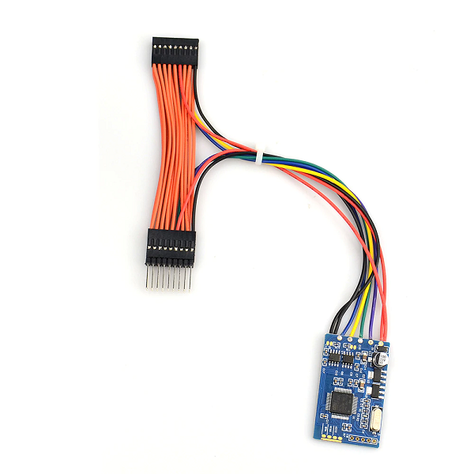
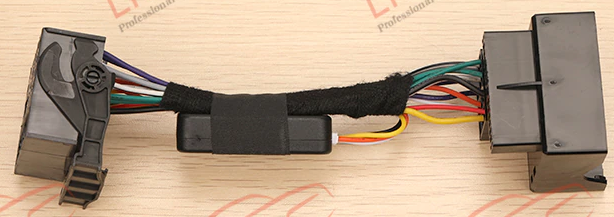
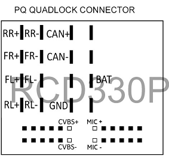
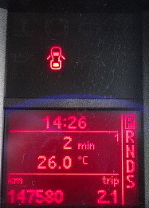
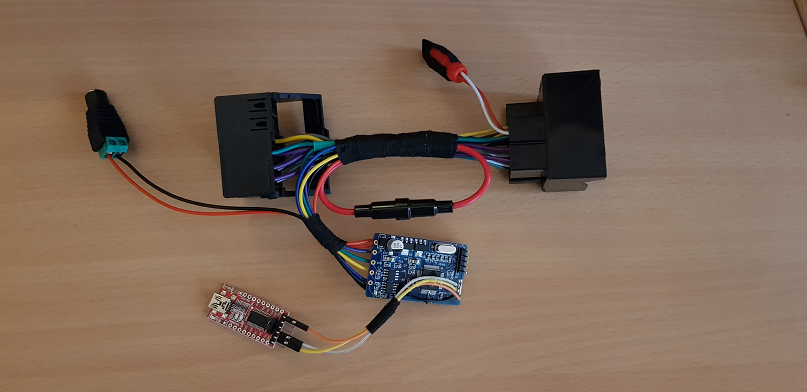

# Golf Mk5 RCD330 CAN Filter - Blue SWD Version #
Allow an RCD330 Head Unit to work in a Golf Mk5 (fixes steering wheel buttons, <B>screen brightness</B> and adds a Google Assistant button)

This DIY project is based on great ideas and information found in this forum:<BR>
https://rcd330plus.com/showthread.php?tid=6741

It is still very much a work in progress.<BR>
A prototype of this blue board version is being tested in a 2007 2.0 FSI Comfortline.
	
This version also adds support for long button press (Mute/Menu).
	
## Hardware ##

Rather than building my own hardware, I decided to search for an existing board that could be easily modified.<BR>
It needed to be reasonably small, but with Dual CAN Bus interfaces to enable true message filtering.<BR>
Also, preferably capable of running directly off 12V.

This search led me to an interesting video:<BR>
 https://www.youtube.com/watch?v=f4af1OBU5nQ<BR>
and then on to these pages:<BR>
 https://dangerouspayload.com/2020/03/10/hacking-a-mileage-manipulator-can-bus-filter-device<BR>
 https://giddi.net/posts/reversing-a-canbus-odometer-filter-manipulator
	
So far, I've only found one other project that is using these devices:<BR>
https://github.com/EliasKotlyar/E46-RPM-CAN-Filter, which is based on:<BR>
https://github.com/EliasKotlyar/Canfilter

These STM32 boards are readily available for under AU$30<BR>
  https://www.aliexpress.com/item/4000238881021.html?spm=a2g0o.order_list.0.0.21ef1802x5VOwn<BR>

	
I've combined the blue version with a common RCD330/PQ adapter cable (although one with cheaper plugs & different coloured wires):<BR>
  https://www.aliexpress.com/item/1005003052063834.html?spm=a2g0o.order_list.0.0.21ef1802x5VOwn

	
Just remove the existing CAN module and cut the CAN bus wires between the plugs.<BR>
Attach the blue filter board in-line between the plugs using those wires (matching CAN high/low connections).<BR>
Each CAN bus interface on the blue board will then have its own plug (i.e. separating RCD330 CAN & Vehicle CAN).<BR>
12V BAT & GND (yellow/black) need to be tapped to power the blue board.<BR>


Cabling on the Blue (SWD) Dual Filter Board:<BR>
(Note: these particular colours also matched my *"new"* green board, but they are NOT always consistent)

| CAN Bus | Polarity | Colour |
| --- | --- | --- |
| CAN1 | High | Green |
| CAN1 | Low | Purple |
| CAN2 | High | Blue |
| CAN2 | Low | Yellow |
	
<B>PQ Quadlock connector (cheapy version, CAN is white/orange on the better one)</B>
* Green	 CAN High
* Purple CAN Low
* YELLOW 12V Battery
* BLACK	 GND
	
It is also necessary to cut the the links between the solder pads (next to the two 120 ohm termination resistors).<BR>
Note: during bench testing, I had to short these out in order to work with a Dual CAN tester (USBCAN-2A) using CANPro Analyzer s/w.

Now any CAN message from the car will need to go through the blue CAN filter to get to the radio (and vice versa).


## Investigation ##

I was curious how the CAN bus module on the original adapter cable worked.<BR>
What messages was it mysteriously modifying to allow the steering wheel buttons to work?

Pulling it apart revealed an STM32F042 and although the SWD pins are exposed, the device is firmware locked using RDP level 1.<BR>
That led to the discovery of an exploit in STM32F0 series processors where RDP-1 can be bypassed:<BR>
https://www.aisec.fraunhofer.de/en/FirmwareProtection.html

Their example code runs on an STM32F051 (which I didn't have), so I ported it to a spare Black Pill.<BR>
Amazingly, it worked and I now have a binary that can be reverse engineered with Ghidra.

It turns out there are only a few messages being checked/modified:<BR>
	
| Msg Id | Function |
| --- | --- |
| **0x2c3/0x575** | Reset the watch dog timer (avoid sleep/stop mode, while car is active) |
| **0x5c1** | Steering Wheel buttons, Up/Down map to Next/Prev in RCD330 |
| **0x436/0x439** | Presumably to fix power down issues, although my car does not send them. The CAN Gateway might be a version that already sends power down messages that the RCD330 understands. |


The module changes the operation of the Up/Down buttons by switching between two modes (using Menu/Ok).<BR>
Pressing Menu (*MFD mode*), only the MFD screens are changed.<BR>
Pressing Ok (*RCD330 mode*), both the MFD and RCD330 are changed (i.e. it sends extra messages for Next/Prev to the RCD330).<BR>
Unfortunately, there is no way to stop the MFD being updated by using a CAN bus filter at the radio.

My car only has an MFD (Midline, Multi Function Display) in the instrument cluster which does not use the Menu button, making it available for other uses.  However, using the Ok button to switch modes is annoying, as it will still impact the MFD on several screens (in particular the speed alert).<BR>



## Implementation ##

Arduino IDE does not support the STM32F105/107 used on these blue/green filter boards.<BR>
I ended up using STM32CubeIDE, which only supports programming via SWD/JTAG, not serial.<BR>
This suits the blue board, as SWD is available via a pin header.<BR>
It made flashing the board much easier than the green version.
	
The blue board also has 4 *"conf"* solder pads available, connected as follows:
	
| Pad | GPIO Pin | New Function |
| --- | --- | --- |
| CONF_S4  | PC12 | LED |
| CONF_W222 | PC11 | UART4 Rx |
| CONF_W166 | PC10 | UART4 Tx |
| CONF_BMW | PA15 | Was EXTI (proposed CAN Driver "S" Pin) |

An FTDI adapter was then attached to UART4 during debugging.

<S>I could not figure out how to get existing CAN & UART Rx pins to also trigger EXTI (needed to wake from deep sleep).<BR>
Apparently it should work, but the HAL libraries might be preventing it from working.<BR>
The PA15 EXTI link above, is connected to CAN2 Rx as a work around.<BR>
So in this blue board version, only the vehicle CAN is able to wake the STM32 from sleep/stop state.<BR>
I think this is reasonable as the watchdog is also only reset by certain messages coming from the vehicle.</S>
	
Managed to get EXTI working directly with the CAN Rx pins.<BR>
In <I><B>stm32f1xx_it.c</B></I>, needed to explicitly add each GPIO Pin into the IRQ Handlers.<BR>
For CAN1 Rx (PA11): in <B>EXTI15_10_IRQHandler()</B> added <B>GPIO_PIN_11</B>.<BR>
For CAN2 Rx (PB5):  in <B>EXTI9_5_IRQHandler()</B> added <B>GPIO_PIN_5</B>.
```c
void EXTI9_5_IRQHandler(void)
{
  /* USER CODE BEGIN EXTI9_5_IRQn 0 */

  HAL_GPIO_EXTI_IRQHandler(GPIO_PIN_5);

  /* USER CODE END EXTI9_5_IRQn 0 */
  //HAL_GPIO_EXTI_IRQHandler(FAKE_EXTI5_Pin);
  /* USER CODE BEGIN EXTI9_5_IRQn 1 */

  /* USER CODE END EXTI9_5_IRQn 1 */
}

void EXTI15_10_IRQHandler(void)
{
  /* USER CODE BEGIN EXTI15_10_IRQn 0 */
  
  HAL_GPIO_EXTI_IRQHandler(GPIO_PIN_11);
  
  /* USER CODE END EXTI15_10_IRQn 0 */
  /* USER CODE BEGIN EXTI15_10_IRQn 1 */
  //HAL_GPIO_EXTI_IRQHandler(FAKE_EXTI10_Pin);
  /* USER CODE END EXTI15_10_IRQn 1 */
}
```
This is in addition to adding the pins to <B>MX_GPIO_Init()</B> in <B><I>main.c</I></B>
```
  /*Configure GPIO pins : FAKE_EXTI5_Pin FAKE_EXTI10_Pin */

  /*Configure GPIO pin : CAN1 Rx (PA11) EXTI */
  GPIO_InitStruct.Pin = GPIO_PIN_11;
  GPIO_InitStruct.Mode = GPIO_MODE_IT_RISING_FALLING;
  GPIO_InitStruct.Pull = GPIO_NOPULL;
  HAL_GPIO_Init(GPIOA, &GPIO_InitStruct);
	
  /*Configure GPIO pin : CAN2 Rx (PB5) EXTI */
  GPIO_InitStruct.Pin = GPIO_PIN_5;
  GPIO_InitStruct.Mode = GPIO_MODE_IT_RISING_FALLING;
  GPIO_InitStruct.Pull = GPIO_NOPULL;
  HAL_GPIO_Init(GPIOB, &GPIO_InitStruct);

  HAL_NVIC_SetPriority(EXTI9_5_IRQn, 0, 0);
  HAL_NVIC_EnableIRQ(EXTI9_5_IRQn);

  HAL_NVIC_SetPriority(EXTI15_10_IRQn, 0, 0);
  HAL_NVIC_EnableIRQ(EXTI15_10_IRQn);
```
Note, had to configure some "fake" EXTI pins (PA5 & PA10) in order to get CubeIDE to generate the required EXTI IRQHandler templates.<BR>
Needed to manually modify them to use the correct pins (as above) and comment out any extra unwanted code for the fake pins...<BR>
There should no longer be a need to solder additional wires to enable EXTI work arounds.<BR>
Unfortunately it is not possible to also enable UART4 Rx EXTI (PA11), as it is shared with CAN1 Rx (PC11) (i.e. both pin 11).<BR>
This is just a limitation of how the STM32 EXTI interrupts are multiplexed together between ports.<BR>

In this version, I am starting to experiment with detecting a button *"long press"*.<BR>
Currently, a *long press* of the Menu button switches it to the default *RCD330 mode*, (short press for *MFD mode*).<BR>
Also, a *long press* of the Mute/Star button will activate *Google Assistant/Siri*.<BR>
Note: a *long press* of the *Phone* button is already detected by the RCD330 as "dial last number*.<BR>
This leaves *long press* of the Ok button still available (not sure doing this on Up/Dn would be a good idea...?)
	
In *RCD330 mode*, this version also sends "opposite messages" back to the MFD for the Up/Down buttons.<BR>
Unfortunately, sending 0x5c1 messages back from the radio towards the MFD does not work :(<BR>
The CAN Gateway might be blocking them, or there is another Msg Id required.<BR>
This article describes how to control an MFD+ from the radio:<BR>
https://pccar-ru.translate.goog/showthread.php?t=24102&_x_tr_sch=http&_x_tr_sl=auto&_x_tr_tl=en&_x_tr_hl=en-US&_x_tr_pto=wapp<BR>
It requires DDP commands running over CAN TP2.0 protocol.  Something like this might be needed to scroll the MFD menus?
	
The brightness message (lights off) was also detected and modified (as discussed in the forum).<BR>
0x635 [3] 0x00 0x00 <B>0x00</B> is changed to:<BR>
0x635 [3] 0x00 0x00 <B>0xdc</B><BR>

I found 0xfe & 0xff actually made the display dim, 0xfd seems to be the max.<BR>
As 0xfd was fairly bright, this version changes it to 0xdc.

All other 0x635 messages are sent through unchanged, so the variable dash back light adjustment still works on the RCD330:<BR>
0x635 [3] <B>0xNN</B> 0x00 0x00 (where <B>0xNN</B> varies from 0x1d to 0x62)<BR>

I have also implemented the 0x436 & 0x439 filtering, but it does not seem to be invoked in my car.
	
Vehicle time & temperature on the RCD330 also works (i.e. when not using Android Auto / CarPlay).

Power consumption is not fantastic, around 50mA running and 20mA in sleep/stop mode.<BR>
The CAN drivers on these boards (MCP2551) seem to have pin 8 (Rs) permanently connected to Gnd.<BR>
This forces *"High-Speed mode"* and has the highest consumption (max. 75mA).<BR>
Tying this to Vcc should enable *"Standby or SLEEP mode"* (typ. under 1mA), which would be useful combined with STM32 sleep/stop mode.<BR>
As the CAN Driver runs on 5V and the STM32 on 3.3V, I was concerned that controlling the "S" pin directly from GPIO (PA15) might not make it go into full sleep mode.<BR>
Testing showed that there is no difference between 3.3V and 5V applied to the S Pin.<BR>
Disapointingly, disabling both drivers only reduces sleep current by around 10mA.
	

<B>Version 2, ready for testing in the car:</B><BR>


The RCA socket is for connecting the vehicle CAN Bus to the rear Flip Camera (Dynamic Lines).<BR>
The DC power socket and FTDI board will be removed on installation (after some preliminary testing).<BR>
They just make it easier to program and debug on the bench.<BR>
I've also included a 500mA fuse, just in case!
	
	
## Future Work ##

If this 2nd prototype proves to be reliable, I am considering some further enhancements:

* See if there are any other useful RCD330 messages that could also be activated from the steering wheel buttons.
* Investigate DDP & TP2.0 further, with the aim of scrolling through MFD screens from the radio.

