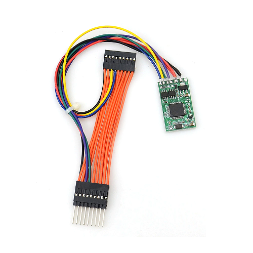
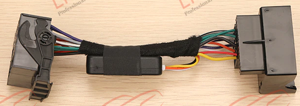

# Golf Mk5 RCD330 CAN Filter
Allow an RCD330 Head Unit to work in a Golf MK5 (fixes steering wheel buttons, screen brightness and adds a Google Assistant button)

This project is based on great ideas and information found in this forum: 
https://rcd330plus.com/showthread.php?tid=6741

	
## Hardware

Rather than building my own hardware, I decided to search for an existing board that could be easily modified. 
It needed to be reasonably small, but with Dual CAN Bus interfaces to enable true message filtering. 
Also, preferably capable of running directly off 12V.

This search led me to an interesting video: 
 https://www.youtube.com/watch?v=f4af1OBU5nQ 
and then on to these pages: 
 https://dangerouspayload.com/2020/03/10/hacking-a-mileage-manipulator-can-bus-filter-device 
 https://giddi.net/posts/reversing-a-canbus-odometer-filter-manipulator

These STM32 boards are readily available for under AU$30 
  https://www.aliexpress.com/item/4000238881021.html?spm=a2g0o.order_list.0.0.21ef1802x5VOwn 

	
Most of the green versions are newer than in the articles above, using different GPIO ports & serial pins on the back.

It is still possible to buy the older green version, but it's almost twice the price: 
  https://www.aliexpress.com/item/1005003130024266.html?spm=a2g0o.order_list.0.0.21ef1802x5VOwn

I've combined a "new" green version with one of these common RCD330-PQ adapter cables: 
  https://www.aliexpress.com/item/1005003052063834.html?spm=a2g0o.order_list.0.0.21ef1802x5VOwn

	
Just remove the existing CAN module and cut the white/orange CAN bus wires between the plugs. 
Attach the green filter board in-line between the plugs using those white/orange wires. 
Each CAN bus interface on the green board will attach to its own plug (i.e. separating RCD330 CAN & Vehicle CAN). 
12V & GND (yellow/black) need to be tapped to power the green board. 

It is also necessary to remove the two 120 ohm termination resistors on the the green board.

Now any CAN message from the car will need to go through the green CAN filter to get to the radio (and vice versa).

## Investigation

I was curious how the CAN bus module on the original adapter cable worked. 
What messages was it mysteriously modifying to allow the steering wheel buttons to work?

Pulling it apart revealed an STM32F042 and although the SWD pins are exposed, the device is firmware locked using RDP level 1. 
That led to the discovery of an exploit in STM32F0 series processors where RDP-1 can be bypassed: 
https://www.aisec.fraunhofer.de/en/FirmwareProtection.html

Their example code runs on an STM32F051 (which I didn't have), so I ported it to a spare Black Pill. 
Amazingly, it worked and I now have a binary that can be reverse engineered with Ghidra.

It turns out there are only a few messages being checked/modified: 
* <B>0x2c3/0x575</B> Reset the watch dog timer (avoid sleep/stop mode, while car is active) 
* <B>0x5c1</B> Steering Wheel buttons, Up/Down map to Next/Prev in RCD330 
* <B>0x436/0x439</B> Presumably to fix power down issues, although my car does not send them. 
Its CAN Gateway might be a version that already sends power down messages that the RCD330 understands.

The module changes the operation of the Up/Down buttons by switching between two modes (using Menu/Ok). 
Pressing Menu (*MFD* mode), only the MFD screens are changed. 
Pressing Ok (*RCD330* mode), both the MFD and RCD330 are changed (i.e. it sends extra messages for Next/Prev to the RCD330). 
Unfortunately, there is no way to stop the MFD being updated by using a CAN bus filter at the radio.

My car only has an MFD (Midline, Multi Function Display) in the instrument cluster which does not use the Menu button, making it available for other uses.  However, using the Ok button to switch modes is annoying, as it will still impact the MFD on several screens. 

## Implementation

I chose the "new" green filter board as it had a couple of features I thought might help during development. 
There is an on board LED (toggle on receiving CAN messages) and it uses serial (for simple control/debug messages) rather than SWD. 
Unfortunately this made programming it a little more difficult. 

Arduino IDE does not support the STM32F105/107 used on these blue/green filter boards. 
I ended up using STM32CubeIDE, but it only supports programming via SWD/JTAG, not serial. 
Flashing was done separately using STM32CubeProgrammer in UART mode. 

This meant the device had to be manually put into bootloader mode. 
I glued & soldered a couple of micro push button switches to the board for NRST & BOOT0. 
BOOT0 is available on one of the pads on the back of the board.  NRST is connected to a cap on the top. 

FTDI connections were also attached to the Tx, Rx & Gnd pads on the underside of the board. 

I could not figure out how to get existing CAN & UART Rx pins to also trigger EXTI (needed to wake from deep sleep). 
Aprarently it should work, but the HAL libraries might be preventing it from working. 
I cheated by configuring the 3 spare "config" inputs and soldering links in parallel with each of the Rx pins (CAN1, CAN2 & USART1). 
These extra GPIO pins were then all configured as separate EXTI inputs (rising/falling) - seems to work fine...

In the initial test version, I have also added an alternate function on the Mute button to send the Google Assistant (Siri) message in MFD mode. 
This was added because the "Hey Google" voice detection on the RCD330 is a bit flaky at times.

The brightness message (lights off) was also detected and modified (as discussed in the forum). 
0x635 [3] 0x00 0x00 <B>0x00</B> is changed to: 
0x635 [3] 0x00 0x00 <B>0xfd</B> 

I found 0xfe & 0xff actually made the display dim, 0xfd seems to be the max. 
It is now so bright, I am running the RCD330 in its "darkest" screen setting. 
I will probably change it to 0xdc in the next version.

All other 0x635 messages are sent through unchanged, so the variable dash back light adjustment still works on the RCD330: 
0x635 [3] <B>0xNN</B> 0x00 0x00 (where <B>0xNN</B> varies from 0x1d to 0x62) 

I have also implemented the 0x436 & 0x439 filtering, but it does not seem to be invoked in my car.

Power consumption is not great, around 50ma running and 20ma in sleep/stop mode. 
The CAN drivers on these boards (TJA1050) do not have a low power standby mode. 
Unlike the original Chinese CAN module which uses a TJA1042.

## Future Work

If the prototype proves to work reliably, I am considering some enhancements:

* Port the s/w to the "blue" board (SWD), just to make sure it can also work.
* Reduce the brightness a bit (using 0xdc value).
* Move the Ok button "RCD330" default mode to a long press of the Menu button.
* In "RCD330" mode: after sending an Up/Down message, immediately send the opposite message (to try and *hide*/work around MFD changes).
* See if there are any other useful RCD330 messages that could also be activated from the steering wheel buttons (using MQB msgs?).
* Swap the CAN drivers with TJA1042, to try and improve power consumption.
